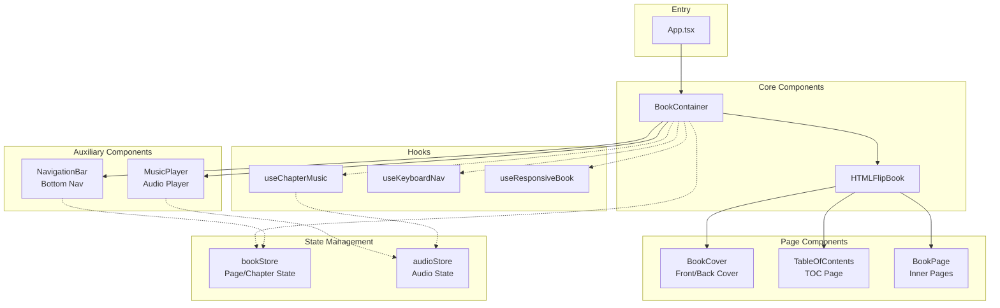
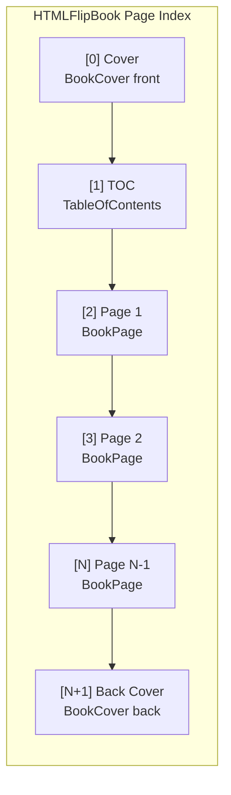
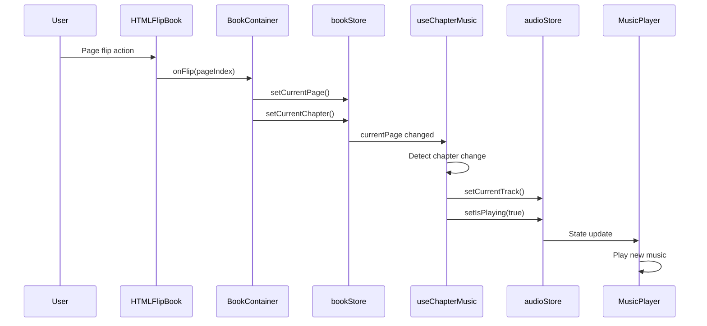
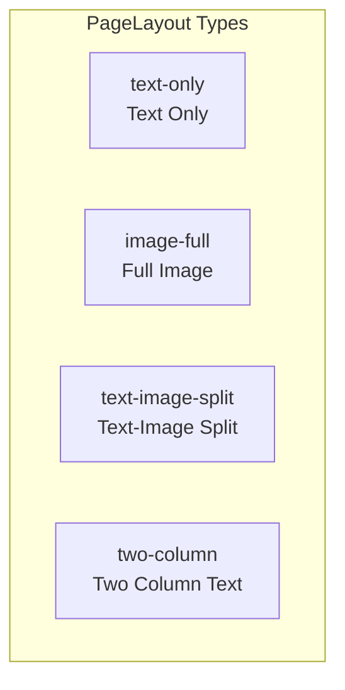
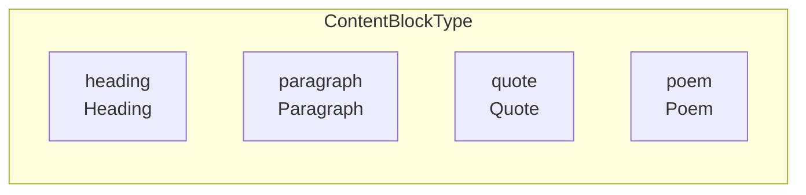

# Chan's Novel - Interactive E-Book Website

[](./README.zh-CN.md)

An interactive personal autobiography e-book website featuring realistic page-flip effects, chapter navigation, auto-playing background music, and responsive design.

## Features

- 📖 **Realistic Page-Flip** - 3D book flipping animation powered by react-pageflip
- 🎵 **Chapter Background Music** - Auto-plays/switches music when entering different chapters
- 📑 **Table of Contents** - Click TOC page or bottom navigation to jump to chapters
- ⌨️ **Keyboard Navigation** - Arrow keys for page turning, Home/End for first/last page
- 📱 **Responsive Design** - Dual-page on desktop, single-page on mobile
- 🚀 **GitHub Pages Deployment** - Automated CI/CD workflow

## Tech Stack

| Category | Technology |
|----------|------------|
| Framework | React 18 + TypeScript |
| Build Tool | Vite 6 |
| Styling | Tailwind CSS 3 |
| State Management | Zustand 5 |
| Page Flip | react-pageflip |
| Icons | Lucide React |

## Project Structure

```
src/
├── components/
│   ├── book/           # Core book components
│   │   ├── BookContainer.tsx   # Main container, integrates all book features
│   │   ├── BookCover.tsx       # Front/back cover
│   │   ├── BookPage.tsx        # Inner page component (forwardRef)
│   │   ├── PageContent.tsx     # Page content renderer
│   │   └── TableOfContents.tsx # TOC page
│   ├── navigation/     # Navigation components
│   │   ├── NavigationBar.tsx   # Floating bottom navigation bar
│   │   ├── ChapterNav.tsx      # Chapter navigation
│   │   └── PageSlider.tsx      # Page slider
│   ├── audio/          # Audio components
│   │   └── MusicPlayer.tsx     # Music player (top-right corner)
│   └── ui/             # Common UI components
├── stores/             # Zustand state management
│   ├── bookStore.ts    # Book state (current page, chapter)
│   └── audioStore.ts   # Audio state (playing, volume)
├── hooks/              # Custom Hooks
│   ├── useChapterMusic.ts    # Chapter music auto-play
│   ├── useKeyboardNav.ts     # Keyboard navigation
│   └── useResponsiveBook.ts  # Responsive size calculation
├── data/               # Data definitions
│   ├── chapters.ts     # Chapter configuration
│   ├── pages.ts        # Page content
│   └── music-config.ts # Music configuration
├── types/              # TypeScript type definitions
└── styles/             # Global styles
```

## Architecture

### Overall Architecture



### Book Page Structure



### Data Flow



### Page Layout Types



### Content Block Types



## Core Type Definitions

```typescript
// Chapter
interface Chapter {
  id: string;
  title: string;
  subtitle?: string;
  startPage: number;  // Starting page number
  endPage: number;    // Ending page number
  music?: MusicTrack; // Chapter background music
}

// Page Data
interface PageData {
  id: string;
  chapterId: string;
  content: ContentBlock[];
  images?: ImageData[];
  layout?: 'text-only' | 'image-full' | 'text-image-split' | 'two-column';
  density?: 'soft' | 'hard';  // Page flip effect: soft/hard page
}

// Content Block
interface ContentBlock {
  type: 'heading' | 'paragraph' | 'quote' | 'poem';
  text: string;
  style?: Record<string, string>;
}
```

## Development Commands

```bash
# Install dependencies
npm install

# Start development server
npm run dev

# Type check + production build
npm run build

# ESLint check
npm run lint

# Preview production build
npm run preview
```

## Adding New Content

### Adding a New Chapter

1. Add chapter definition in `src/data/chapters.ts`:

```typescript
{
  id: 'chapter-4',
  title: 'Chapter 4: New Beginning',
  subtitle: 'Moving Forward',
  startPage: 15,
  endPage: 18,
  music: {
    id: 'music-new',
    title: 'New Track',
    src: 'https://example.com/music.mp3',
  },
}
```

2. Add corresponding page content in `src/data/pages.ts`

3. If using separate music, configure mapping in `src/data/music-config.ts`

### Adding a New Page

Add to the `pages` array in `src/data/pages.ts`:

```typescript
{
  id: 'page-15',
  chapterId: 'chapter-4',
  layout: 'text-image-split',
  content: [
    { type: 'heading', text: 'Title' },
    { type: 'paragraph', text: 'Body content...' },
  ],
  images: [
    { src: '/assets/images/photo.jpg', alt: 'Description', caption: 'Image caption' },
  ],
}
```

## Keyboard Shortcuts

| Key | Function |
|-----|----------|
| `←` / `PageUp` | Previous page |
| `→` / `PageDown` | Next page |
| `Home` | Go to cover |
| `End` | Go to back cover |

## Deployment

The project is configured with GitHub Actions for automatic deployment to GitHub Pages:

- **Trigger**: Push to `master` branch
- **Build Output**: `dist/` directory
- **Base URL**: `/chan-meng-novel-web/`

Deployment workflow:
1. Push code to `master` branch
2. GitHub Actions automatically runs `npm ci` and `npm run build`
3. Build artifacts are automatically deployed to GitHub Pages

## Path Alias

The project configures `@/*` path alias pointing to `./src/*`, synchronized in both `tsconfig.json` and `vite.config.ts`.

```typescript
// Usage example
import { useBookStore } from '@/stores';
import { chapters } from '@/data/chapters';
```

## Important Notes

1. **forwardRef Required**: Components directly used as HTMLFlipBook children (`BookPage`, `BookCover`, `TableOfContents`) must use `forwardRef` because react-pageflip needs DOM element access

2. **Page Index Calculation**: Actual page index = content page number + 2 (cover at index 0, TOC at index 1)

3. **Responsive Design**: Book dimensions are dynamically calculated based on 2:3 aspect ratio, switches to single-page mode on mobile (< 768px)

4. **Audio Autoplay**: Due to browser policy restrictions, first playback requires user interaction
