# Flip Book - Universal E-Book Template

<div align="center">

[](https://react.dev/)
[](https://www.typescriptlang.org/)
[](https://tailwindcss.com/)
[](https://vitejs.dev/)
[](LICENSE)

**Create beautiful, interactive digital books with realistic page-flip effects.**

[Live Demo](https://chanmeng666.github.io/flip-book-template/) · [Report Bug](https://github.com/ChanMeng666/flip-book-template/issues) · [Request Feature](https://github.com/ChanMeng666/flip-book-template/issues)

</div>

---

## Overview

Flip Book is a **configuration-driven e-book template** that allows you to create stunning interactive digital books without writing any React code. Simply edit two configuration files to customize your book's content, styling, and background music.

### Key Features

- **Realistic Page-Flip Animation** - 3D book flipping powered by react-pageflip
- **Chapter-Based Background Music** - Auto-switches music when entering different chapters
- **Dual Music Support** - Direct audio files (MP3) or Spotify embeds
- **Easy Configuration** - Only 2 files to edit: `book.config.ts` and `content.config.ts`
- **Responsive Design** - Dual-page on desktop, single-page on mobile
- **Keyboard Navigation** - Arrow keys, Home/End support
- **GitHub Pages Ready** - One-click deployment with included workflow

---

## Quick Start

### 1. Use This Template

Click the **"Use this template"** button on GitHub, or clone the repository:

```bash
git clone https://github.com/ChanMeng666/flip-book-template.git my-ebook
cd my-ebook
npm install
npm run dev
```

### 2. Edit Configuration Files

You only need to modify **2 files** in the `src/config/` folder:

```
src/config/
├── book.config.ts      # Book info + theme colors
└── content.config.ts   # Music + chapters + pages
```

### 3. Deploy to GitHub Pages

Push to your repository and GitHub Actions will automatically deploy your book.

---

## Configuration Guide

### Configuration Architecture


---

## Book Configuration (`book.config.ts`)

This file controls your book's metadata and visual theme.

### Basic Structure

```typescript
export const bookConfig: BookConfig = {
  book: {
    title: "My Book Title",
    subtitle: "An optional subtitle",
    author: "Your Name",
    year: 2024,
    backCover: {
      quote: '"A meaningful quote for the back cover."',
      copyright: "All Rights Reserved",
    },
  },
  theme: {
    colors: { /* ... */ },
    fonts: { /* ... */ },
  },
  features: {
    music: { /* ... */ },
    navigation: { /* ... */ },
  },
};
```

### Theme Colors

Customize your book's color scheme:

```typescript
theme: {
  colors: {
    // Cover appearance
    cover: '#8B4513',           // Cover main color
    coverGradient: '#654321',   // Cover gradient color
    coverText: '#F5DEB3',       // Cover text color

    // Inner pages
    paper: '#FDF5E6',           // Paper background
    text: '#2C1810',            // Body text color
    accent: '#D4A574',          // Decorative elements

    // Page background (behind the book)
    background: '#2C1810',
    backgroundGradient: '#4A3728',
  },
}
```

### Color Scheme Examples

| Theme | Cover | Cover Gradient | Paper | Text |
|-------|-------|----------------|-------|------|
| Classic Brown | `#8B4513` | `#654321` | `#FDF5E6` | `#2C1810` |
| Modern Blue | `#1E3A5F` | `#0D1B2A` | `#F8FAFC` | `#1E293B` |
| Elegant Green | `#2D5016` | `#1A3009` | `#F0FDF4` | `#14532D` |
| Romantic Pink | `#831843` | `#500724` | `#FFF1F2` | `#881337` |

### Feature Toggles

```typescript
features: {
  music: {
    enabled: true,           // Enable/disable music player
    autoPlay: false,         // Auto-play on chapter enter
    showExternalLink: true,  // Show link to music source
  },
  navigation: {
    showPageSlider: true,    // Show page progress slider
    showChapterNav: true,    // Show chapter navigation
    keyboardNav: true,       // Enable keyboard shortcuts
  },
}
```

---

## Content Configuration (`content.config.ts`)

This file defines your book's music, chapters, and pages.

### Content Structure

```mermaid
graph LR
    subgraph "content.config.ts"
        M[Music<br/>Record&lt;string, MusicTrack&gt;]
        C[Chapters<br/>ChapterConfig[]]
        P[Pages<br/>PageConfig[]]
    end

    M -->|musicId| C
    C -->|chapterId| P

    subgraph "Auto-Calculated"
        C -->|startPage/endPage| AC[Processed Chapters]
        P -->|pageNumber| AP[Processed Pages]
    end
```

### Defining Music

Define all your background music tracks, then reference them in chapters by `musicId`:

```typescript
const music: Record<string, MusicTrackConfig> = {
  // Direct audio file (full playback control)
  'main-theme': {
    id: 'main-theme',
    title: 'Background Music',
    type: 'audio',
    src: 'https://example.com/music.mp3',
    externalUrl: 'https://example.com/song-page',  // Optional
  },

  // Spotify embed (requires user interaction)
  'chapter3-spotify': {
    id: 'chapter3-spotify',
    title: 'Spotify Track',
    type: 'spotify',
    spotifyTrackId: '6JHNsajzqfEBEcqm9nvb7Z',  // From Spotify URL
    externalUrl: 'https://open.spotify.com/track/...',
  },
};
```

### Music Types Comparison

| Feature | `type: 'audio'` | `type: 'spotify'` |
|---------|-----------------|-------------------|
| Auto-play | Yes (if enabled) | No (requires click) |
| Playback control | Full | Limited (Spotify controls) |
| Offline support | Yes | No |
| File hosting | Self-hosted URL | Spotify servers |
| UI | Simple play/pause button | Expandable Spotify player |

### How to Get Spotify Track ID

From a Spotify URL like:
```
https://open.spotify.com/track/6JHNsajzqfEBEcqm9nvb7Z
```
The track ID is: `6JHNsajzqfEBEcqm9nvb7Z`

### Defining Chapters

Chapters organize your content and can have associated music:

```typescript
const chapters: ChapterConfig[] = [
  {
    id: 'preface',
    title: 'Preface',
    subtitle: 'Before We Begin',
    musicId: undefined,  // No music for this chapter
  },
  {
    id: 'chapter-1',
    title: 'Chapter 1: The Beginning',
    subtitle: 'Where it all started',
    musicId: 'main-theme',  // References music defined above
  },
  {
    id: 'chapter-2',
    title: 'Chapter 2: The Journey',
    musicId: 'main-theme',  // Same music continues
  },
  {
    id: 'chapter-3',
    title: 'Chapter 3: New Horizons',
    musicId: 'chapter3-spotify',  // Different music
  },
];
```

> **Note:** Page ranges (`startPage`/`endPage`) are **automatically calculated** based on page order. You don't need to maintain them manually!

### Music Switching Behavior


### Defining Pages

Each page belongs to a chapter and contains content blocks:

```typescript
const pages: PageConfig[] = [
  // Chapter title page
  {
    chapterId: 'chapter-1',
    layout: 'text-only',
    density: 'hard',  // Hard page for chapter starts
    content: [
      { type: 'heading', text: 'Chapter 1' },
      { type: 'heading', text: 'The Beginning' },
      { type: 'paragraph', text: 'An introductory paragraph...' },
    ],
  },

  // Text with image
  {
    chapterId: 'chapter-1',
    layout: 'text-image-split',
    content: [
      { type: 'paragraph', text: 'Story content here...' },
      { type: 'quote', text: '"A meaningful quote."' },
    ],
    images: [
      {
        src: '/assets/images/photo.jpg',
        alt: 'Description',
        caption: 'Photo caption',
      },
    ],
  },

  // Full-page image
  {
    chapterId: 'chapter-1',
    layout: 'image-full',
    content: [],
    images: [
      { src: '/assets/images/landscape.jpg', alt: 'Scenic view' },
    ],
  },
];
```

### Page Layouts

```mermaid
graph TB
    subgraph "Layout Types"
        TO["text-only<br/>📄 Text content only"]
        IF["image-full<br/>🖼️ Full-page image"]
        TIS["text-image-split<br/>📄🖼️ Side by side"]
        TC["two-column<br/>📄📄 Two text columns"]
    end
```



| Layout | Description | Best For |
|--------|-------------|----------|
| `text-only` | Text content fills the page | Chapters, prose |
| `image-full` | Single image fills the page | Photos, artwork |
| `text-image-split` | Text on left, image on right | Illustrated content |
| `two-column` | Text in two columns | Dense text |

### Content Block Types

| Type | Example | Usage |
|------|---------|-------|
| `heading` | `{ type: 'heading', text: 'Title' }` | Chapter titles, section headers |
| `paragraph` | `{ type: 'paragraph', text: '...' }` | Body text |
| `quote` | `{ type: 'quote', text: '"..."' }` | Quotations, emphasis |
| `poem` | `{ type: 'poem', text: '...' }` | Poetry, verse |

### Page Density

The `density` property controls the page-flip feel:

- `'soft'` - Default, flexible page flip
- `'hard'` - Stiff page, good for chapter title pages

---

## Adding Images

Place your images in the `public/assets/images/` folder:

```
public/
└── assets/
    └── images/
        ├── chapter1/
        │   ├── photo1.jpg
        │   └── photo2.jpg
        └── chapter2/
            └── landscape.jpg
```

Reference them in your config:

```typescript
images: [
  {
    src: '/assets/images/chapter1/photo1.jpg',
    alt: 'Descriptive text for accessibility',
    caption: 'Optional caption below image',
  },
]
```

---

## Deployment

### GitHub Pages (Recommended)

This template includes a GitHub Actions workflow for automatic deployment.

#### Step 1: Enable GitHub Pages

1. Go to your repository **Settings**
2. Navigate to **Pages** section
3. Under **Source**, select **GitHub Actions**

#### Step 2: Configure Base URL

Edit `vite.config.ts` and update the `base` path to match your repository name:

```typescript
export default defineConfig({
  base: '/your-repo-name/',  // Must match your GitHub repo name
  // ...
});
```

#### Step 3: Push and Deploy

```bash
git add .
git commit -m "Configure for deployment"
git push origin master
```

The workflow will automatically build and deploy your book. Check the **Actions** tab for status.

#### Deployment Flow


### Custom Domain (Optional)

1. Add a `CNAME` file in the `public/` folder with your domain
2. Configure DNS settings with your domain provider
3. Enable HTTPS in repository settings

---

## Development

### Commands

```bash
npm install      # Install dependencies
npm run dev      # Start development server
npm run build    # Type check + production build
npm run lint     # Run ESLint
npm run preview  # Preview production build
```

### Project Structure

```
src/
├── config/                 # 👈 USER CONFIGURATION
│   ├── book.config.ts      # Book info & theme
│   └── content.config.ts   # Music, chapters & pages
│
├── components/
│   ├── book/               # Book components
│   ├── navigation/         # Navigation UI
│   └── audio/              # Music player
│
├── lib/
│   ├── config-loader.ts    # Config processing
│   └── theme-loader.ts     # Theme application
│
├── stores/                 # Zustand state
├── hooks/                  # Custom React hooks
├── types/                  # TypeScript definitions
└── styles/                 # Global CSS
```

### Architecture


---

## Keyboard Shortcuts

| Key | Action |
|-----|--------|
| `←` / `PageUp` | Previous page |
| `→` / `PageDown` | Next page |
| `Home` | Go to cover |
| `End` | Go to back cover |

---

## Tech Stack

| Category | Technology |
|----------|------------|
| Framework | React 18 + TypeScript |
| Build Tool | Vite 6 |
| Styling | Tailwind CSS 3 |
| State | Zustand 5 |
| Page Flip | react-pageflip |
| Icons | Lucide React |

---

## FAQ

### Why doesn't music auto-play?

Modern browsers block auto-play to improve user experience. Users must interact with the page first. The music will play after any click on the book.

### Can I use local audio files?

Yes! Place MP3 files in `public/assets/audio/` and reference them:

```typescript
{
  id: 'local-music',
  title: 'Local Track',
  type: 'audio',
  src: '/assets/audio/background.mp3',
}
```

### How do I add more chapters?

1. Add chapter definition to `chapters` array in `content.config.ts`
2. Add corresponding pages with matching `chapterId`
3. Page ranges are calculated automatically

### Can I change the page flip animation speed?

Edit `BookContainer.tsx` and modify the `flippingTime` prop:

```typescript
<HTMLFlipBook
  flippingTime={800}  // milliseconds
  // ...
/>
```

---

## Contributing

Contributions are welcome! Please feel free to submit a Pull Request.

---

## License

This project is licensed under the MIT License - see the [LICENSE](LICENSE) file for details.

---

<div align="center">

**Made with love for storytellers and book lovers**

[⬆ Back to Top](#flip-book---universal-e-book-template)

</div>
