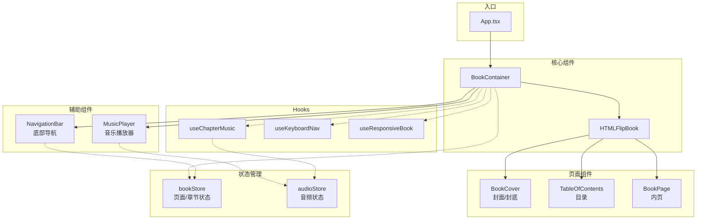
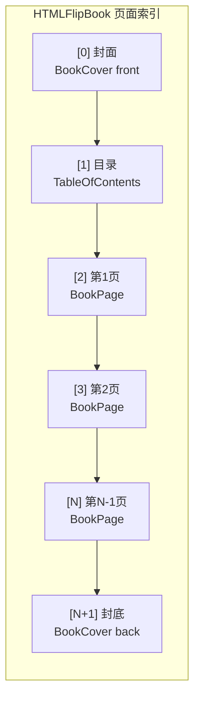
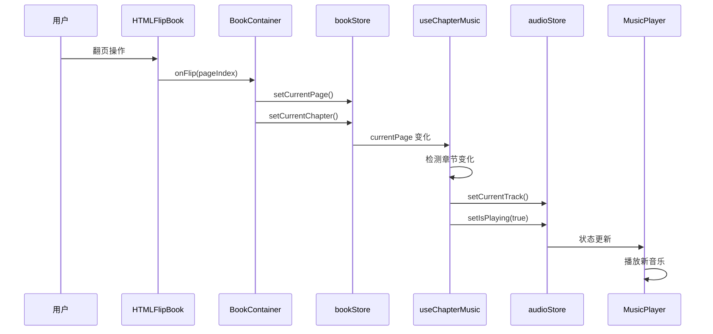
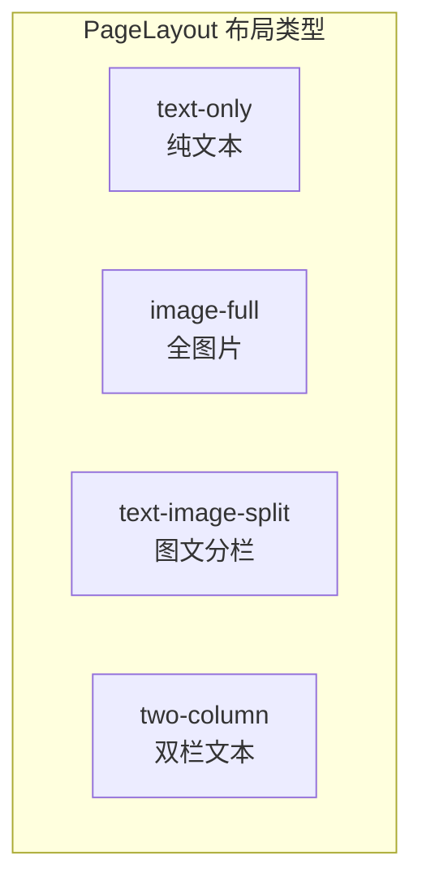
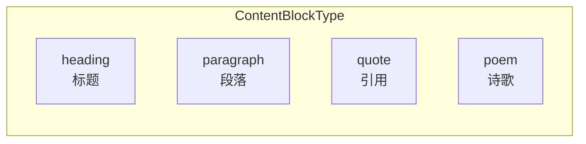

# Chan's Novel - 互动式电子书网站

一个具有逼真翻页效果的个人自传电子书网站，支持章节导航、背景音乐自动播放和响应式设计。

## 功能特性

- 📖 **逼真翻页效果** - 基于 react-pageflip 实现的 3D 翻书动画
- 🎵 **章节背景音乐** - 进入不同章节自动切换/播放背景音乐
- 📑 **目录导航** - 可点击目录页或底部导航快速跳转章节
- ⌨️ **键盘支持** - 方向键翻页，Home/End 跳转首尾
- 📱 **响应式设计** - 桌面双页展示，移动端单页展示
- 🚀 **GitHub Pages 部署** - 自动化 CI/CD 部署流程

## 技术栈

| 类别 | 技术 |
|------|------|
| 框架 | React 18 + TypeScript |
| 构建 | Vite 6 |
| 样式 | Tailwind CSS 3 |
| 状态管理 | Zustand 5 |
| 翻页动画 | react-pageflip |
| 图标 | Lucide React |

## 项目结构

```
src/
├── components/
│   ├── book/           # 书籍核心组件
│   │   ├── BookContainer.tsx   # 主容器，整合所有书籍功能
│   │   ├── BookCover.tsx       # 封面/封底
│   │   ├── BookPage.tsx        # 内页组件（forwardRef）
│   │   ├── PageContent.tsx     # 页面内容渲染
│   │   └── TableOfContents.tsx # 目录页
│   ├── navigation/     # 导航组件
│   │   ├── NavigationBar.tsx   # 底部浮动导航栏
│   │   ├── ChapterNav.tsx      # 章节导航
│   │   └── PageSlider.tsx      # 页面滑块
│   ├── audio/          # 音频组件
│   │   └── MusicPlayer.tsx     # 音乐播放器（右上角）
│   └── ui/             # 通用UI组件
├── stores/             # Zustand 状态管理
│   ├── bookStore.ts    # 书籍状态（当前页、章节）
│   └── audioStore.ts   # 音频状态（播放、音量）
├── hooks/              # 自定义 Hooks
│   ├── useChapterMusic.ts    # 章节音乐自动播放
│   ├── useKeyboardNav.ts     # 键盘导航
│   └── useResponsiveBook.ts  # 响应式尺寸计算
├── data/               # 数据定义
│   ├── chapters.ts     # 章节配置
│   ├── pages.ts        # 页面内容
│   └── music-config.ts # 音乐配置
├── types/              # TypeScript 类型定义
└── styles/             # 全局样式
```

## 架构设计

### 整体架构



### 书籍页面结构



### 数据流



### 页面布局类型



### 内容块类型



## 核心类型定义

```typescript
// 章节
interface Chapter {
  id: string;
  title: string;
  subtitle?: string;
  startPage: number;  // 起始页码
  endPage: number;    // 结束页码
  music?: MusicTrack; // 章节背景音乐
}

// 页面数据
interface PageData {
  id: string;
  chapterId: string;
  content: ContentBlock[];
  images?: ImageData[];
  layout?: 'text-only' | 'image-full' | 'text-image-split' | 'two-column';
  density?: 'soft' | 'hard';  // 翻页效果：软页/硬页
}

// 内容块
interface ContentBlock {
  type: 'heading' | 'paragraph' | 'quote' | 'poem';
  text: string;
  style?: Record<string, string>;
}
```

## 开发命令

```bash
# 安装依赖
npm install

# 启动开发服务器
npm run dev

# 类型检查 + 生产构建
npm run build

# ESLint 检查
npm run lint

# 预览生产构建
npm run preview
```

## 添加新内容

### 添加新章节

1. 在 `src/data/chapters.ts` 中添加章节定义：

```typescript
{
  id: 'chapter-4',
  title: '第四章：新的开始',
  subtitle: '继续前行',
  startPage: 15,
  endPage: 18,
  music: {
    id: 'music-new',
    title: '新曲目',
    src: 'https://example.com/music.mp3',
  },
}
```

2. 在 `src/data/pages.ts` 中添加对应页面内容

3. 如需独立音乐，在 `src/data/music-config.ts` 中配置映射

### 添加新页面

在 `src/data/pages.ts` 的 `pages` 数组中添加：

```typescript
{
  id: 'page-15',
  chapterId: 'chapter-4',
  layout: 'text-image-split',
  content: [
    { type: 'heading', text: '标题' },
    { type: 'paragraph', text: '正文内容...' },
  ],
  images: [
    { src: '/assets/images/photo.jpg', alt: '描述', caption: '图片说明' },
  ],
}
```

## 键盘快捷键

| 按键 | 功能 |
|------|------|
| `←` / `PageUp` | 上一页 |
| `→` / `PageDown` | 下一页 |
| `Home` | 跳转封面 |
| `End` | 跳转封底 |

## 部署

项目配置了 GitHub Actions 自动部署到 GitHub Pages：

- **触发条件**：推送到 `master` 分支
- **构建输出**：`dist/` 目录
- **Base URL**：`/chan-meng-novel-web/`

部署流程：
1. 推送代码到 `master` 分支
2. GitHub Actions 自动执行 `npm ci` 和 `npm run build`
3. 构建产物自动部署到 GitHub Pages

## 路径别名

项目配置了 `@/*` 路径别名指向 `./src/*`，在 `tsconfig.json` 和 `vite.config.ts` 中同步配置。

```typescript
// 使用示例
import { useBookStore } from '@/stores';
import { chapters } from '@/data/chapters';
```

## 注意事项

1. **forwardRef 必需**：`BookPage`、`BookCover`、`TableOfContents` 等直接作为 HTMLFlipBook 子组件的组件必须使用 `forwardRef`，因为 react-pageflip 需要访问 DOM 元素

2. **页码计算**：实际页面索引 = 内容页码 + 2（封面占索引0，目录占索引1）

3. **响应式设计**：书籍尺寸基于 2:3 宽高比动态计算，移动端（< 768px）切换为单页模式

4. **音频自动播放**：浏览器策略限制，首次播放需要用户交互触发
