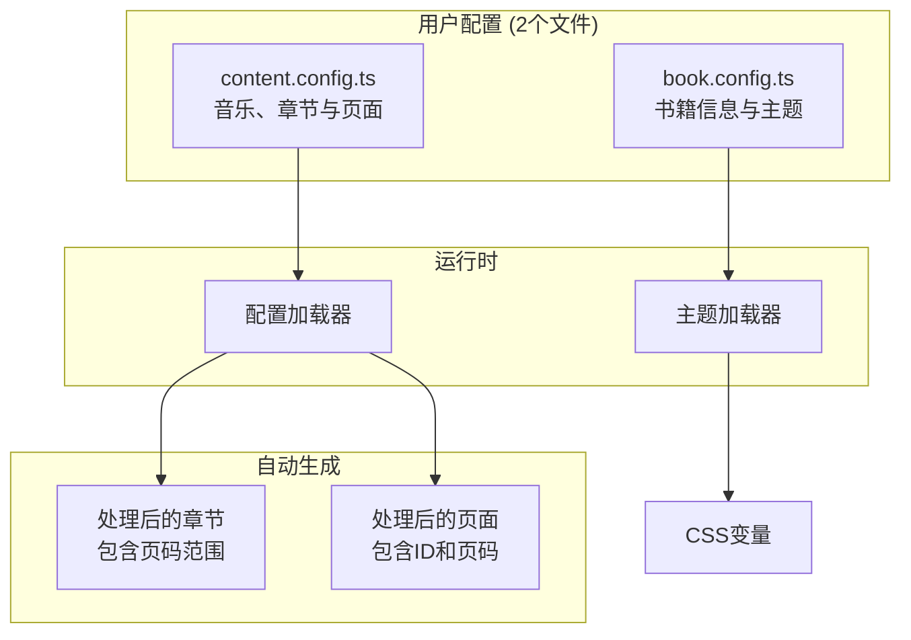
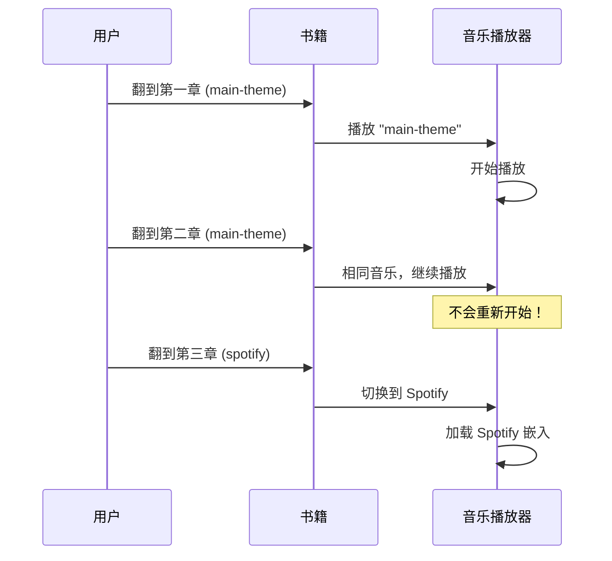
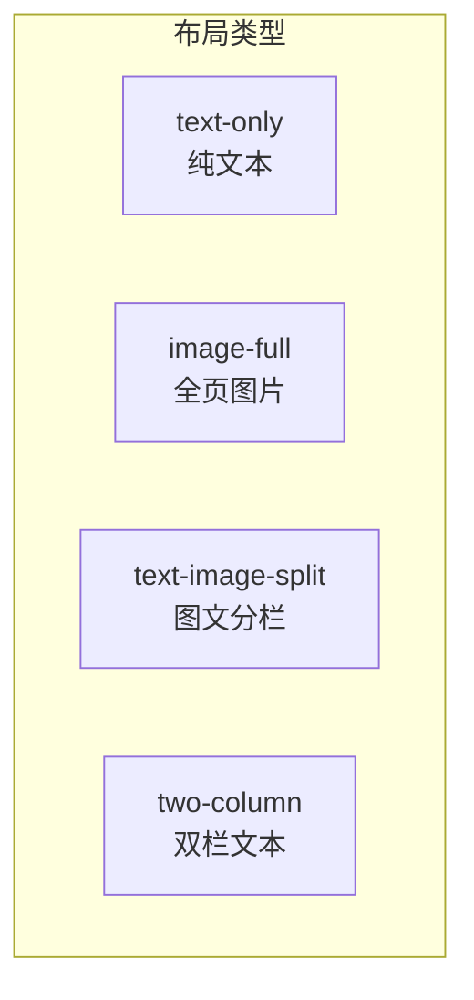
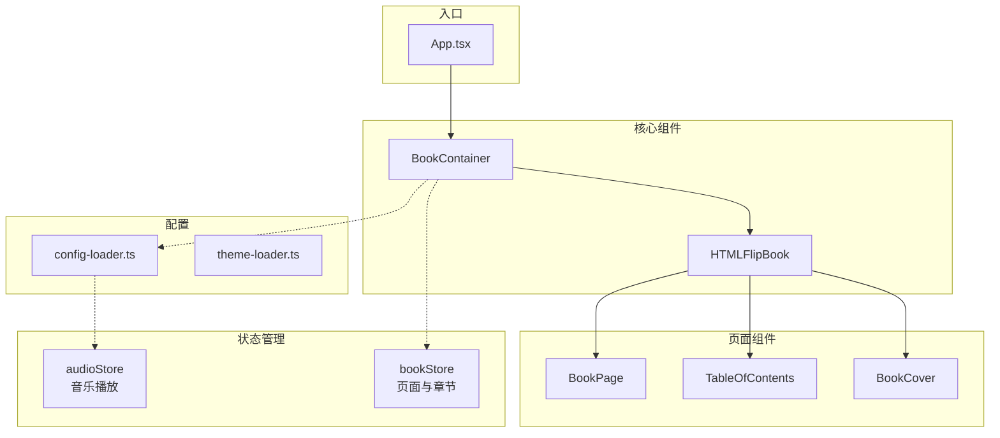

# Flip Book - 通用电子书模板

<div align="center">

[](https://react.dev/)
[](https://www.typescriptlang.org/)
[](https://tailwindcss.com/)
[](https://vitejs.dev/)
[](LICENSE)

**创建精美的互动式数字书籍，带有逼真的翻页效果**

[在线演示](https://chanmeng666.github.io/chan-meng-novel-web/) · [报告问题](https://github.com/ChanMeng666/chan-meng-novel-web/issues) · [功能建议](https://github.com/ChanMeng666/chan-meng-novel-web/issues)

</div>

---

## 项目简介

Flip Book 是一个**配置驱动的电子书模板**，让你无需编写任何 React 代码即可创建精美的互动式数字书籍。只需编辑两个配置文件，即可自定义书籍内容、样式和背景音乐。

### 核心特性

- **逼真翻页动画** - 基于 react-pageflip 的 3D 翻书效果
- **章节背景音乐** - 进入不同章节自动切换音乐
- **双音乐支持** - 支持直接音频文件 (MP3) 或 Spotify 嵌入
- **简单配置** - 只需编辑 2 个文件：`book.config.ts` 和 `content.config.ts`
- **响应式设计** - 桌面双页展示，移动端单页展示
- **键盘导航** - 支持方向键、Home/End 快捷键
- **GitHub Pages 就绪** - 内置自动部署工作流

---

## 快速开始

### 1. 使用此模板

点击 GitHub 上的 **"Use this template"** 按钮，或克隆仓库：

```bash
git clone https://github.com/ChanMeng666/chan-meng-novel-web.git my-ebook
cd my-ebook
npm install
npm run dev
```

### 2. 编辑配置文件

只需修改 `src/config/` 文件夹中的 **2 个文件**：

```
src/config/
├── book.config.ts      # 书籍信息 + 主题颜色
└── content.config.ts   # 音乐 + 章节 + 页面
```

### 3. 部署到 GitHub Pages

推送到你的仓库，GitHub Actions 将自动部署你的书籍。

---

## 配置指南

### 配置架构



---

## 书籍配置 (`book.config.ts`)

此文件控制书籍的元数据和视觉主题。

### 基本结构

```typescript
export const bookConfig: BookConfig = {
  book: {
    title: "我的书名",
    subtitle: "可选的副标题",
    author: "作者名",
    year: 2024,
    backCover: {
      quote: '"封底的一句话。"',
      copyright: "版权所有",
    },
  },
  theme: {
    colors: { /* ... */ },
    fonts: { /* ... */ },
  },
  features: {
    music: { /* ... */ },
    navigation: { /* ... */ },
  },
};
```

### 主题颜色

自定义书籍的配色方案：

```typescript
theme: {
  colors: {
    // 封面外观
    cover: '#8B4513',           // 封面主色
    coverGradient: '#654321',   // 封面渐变色
    coverText: '#F5DEB3',       // 封面文字颜色

    // 内页
    paper: '#FDF5E6',           // 纸张背景
    text: '#2C1810',            // 正文颜色
    accent: '#D4A574',          // 装饰元素

    // 页面背景（书籍后面）
    background: '#2C1810',
    backgroundGradient: '#4A3728',
  },
}
```

### 配色方案示例

| 主题 | 封面色 | 渐变色 | 纸张色 | 文字色 |
|------|--------|--------|--------|--------|
| 经典棕色 | `#8B4513` | `#654321` | `#FDF5E6` | `#2C1810` |
| 现代蓝色 | `#1E3A5F` | `#0D1B2A` | `#F8FAFC` | `#1E293B` |
| 优雅绿色 | `#2D5016` | `#1A3009` | `#F0FDF4` | `#14532D` |
| 浪漫粉色 | `#831843` | `#500724` | `#FFF1F2` | `#881337` |

### 功能开关

```typescript
features: {
  music: {
    enabled: true,           // 启用/禁用音乐播放器
    autoPlay: false,         // 进入章节时自动播放
    showExternalLink: true,  // 显示音乐来源链接
  },
  navigation: {
    showPageSlider: true,    // 显示页码滑块
    showChapterNav: true,    // 显示章节导航
    keyboardNav: true,       // 启用键盘快捷键
  },
}
```

---

## 内容配置 (`content.config.ts`)

此文件定义书籍的音乐、章节和页面。

### 内容结构

```mermaid
graph LR
    subgraph "content.config.ts"
        M[音乐<br/>Record&lt;string, MusicTrack&gt;]
        C[章节<br/>ChapterConfig[]]
        P[页面<br/>PageConfig[]]
    end

    M -->|musicId| C
    C -->|chapterId| P

    subgraph "自动计算"
        C -->|startPage/endPage| AC[处理后的章节]
        P -->|pageNumber| AP[处理后的页面]
    end
```

### 定义音乐

定义所有背景音乐，然后在章节中通过 `musicId` 引用：

```typescript
const music: Record<string, MusicTrackConfig> = {
  // 直接音频文件（完全播放控制）
  'main-theme': {
    id: 'main-theme',
    title: '背景音乐',
    type: 'audio',
    src: 'https://example.com/music.mp3',
    externalUrl: 'https://example.com/song-page',  // 可选
  },

  // Spotify 嵌入（需要用户交互）
  'chapter3-spotify': {
    id: 'chapter3-spotify',
    title: 'Spotify 曲目',
    type: 'spotify',
    spotifyTrackId: '6JHNsajzqfEBEcqm9nvb7Z',  // 从 Spotify URL 提取
    externalUrl: 'https://open.spotify.com/track/...',
  },
};
```

### 音乐类型对比

| 特性 | `type: 'audio'` | `type: 'spotify'` |
|------|-----------------|-------------------|
| 自动播放 | 是（如果启用） | 否（需要点击） |
| 播放控制 | 完全控制 | 有限（Spotify 控制） |
| 离线支持 | 是 | 否 |
| 文件托管 | 自托管 URL | Spotify 服务器 |
| 界面 | 简单播放/暂停按钮 | 可展开的 Spotify 播放器 |

### 如何获取 Spotify 曲目 ID

从 Spotify URL 如：
```
https://open.spotify.com/track/6JHNsajzqfEBEcqm9nvb7Z
```
曲目 ID 是：`6JHNsajzqfEBEcqm9nvb7Z`

### 定义章节

章节组织你的内容，可以关联音乐：

```typescript
const chapters: ChapterConfig[] = [
  {
    id: 'preface',
    title: '序言',
    subtitle: '写在前面',
    musicId: undefined,  // 此章节无音乐
  },
  {
    id: 'chapter-1',
    title: '第一章：开始',
    subtitle: '一切的起点',
    musicId: 'main-theme',  // 引用上面定义的音乐
  },
  {
    id: 'chapter-2',
    title: '第二章：旅程',
    musicId: 'main-theme',  // 相同音乐继续播放
  },
  {
    id: 'chapter-3',
    title: '第三章：新视野',
    musicId: 'chapter3-spotify',  // 不同的音乐
  },
];
```

> **注意：** 页码范围（`startPage`/`endPage`）会根据页面顺序**自动计算**。你不需要手动维护！

### 音乐切换行为



### 定义页面

每个页面属于一个章节，包含内容块：

```typescript
const pages: PageConfig[] = [
  // 章节标题页
  {
    chapterId: 'chapter-1',
    layout: 'text-only',
    density: 'hard',  // 章节开始使用硬页
    content: [
      { type: 'heading', text: '第一章' },
      { type: 'heading', text: '开始' },
      { type: 'paragraph', text: '引言段落...' },
    ],
  },

  // 图文混排
  {
    chapterId: 'chapter-1',
    layout: 'text-image-split',
    content: [
      { type: 'paragraph', text: '故事内容...' },
      { type: 'quote', text: '"一句有意义的话。"' },
    ],
    images: [
      {
        src: '/assets/images/photo.jpg',
        alt: '描述',
        caption: '图片说明',
      },
    ],
  },

  // 全页图片
  {
    chapterId: 'chapter-1',
    layout: 'image-full',
    content: [],
    images: [
      { src: '/assets/images/landscape.jpg', alt: '风景图' },
    ],
  },
];
```

### 页面布局



| 布局 | 描述 | 适用场景 |
|------|------|----------|
| `text-only` | 文本填满页面 | 章节、散文 |
| `image-full` | 单张图片填满页面 | 照片、艺术作品 |
| `text-image-split` | 左文右图 | 配图内容 |
| `two-column` | 文本分两栏 | 密集文本 |

### 内容块类型

| 类型 | 示例 | 用途 |
|------|------|------|
| `heading` | `{ type: 'heading', text: '标题' }` | 章节标题、小节标题 |
| `paragraph` | `{ type: 'paragraph', text: '...' }` | 正文 |
| `quote` | `{ type: 'quote', text: '"..."' }` | 引用、强调 |
| `poem` | `{ type: 'poem', text: '...' }` | 诗歌、韵文 |

### 页面硬度

`density` 属性控制翻页手感：

- `'soft'` - 默认，柔软翻页
- `'hard'` - 硬挺翻页，适合章节标题页

---

## 添加图片

将图片放在 `public/assets/images/` 文件夹中：

```
public/
└── assets/
    └── images/
        ├── chapter1/
        │   ├── photo1.jpg
        │   └── photo2.jpg
        └── chapter2/
            └── landscape.jpg
```

在配置中引用：

```typescript
images: [
  {
    src: '/assets/images/chapter1/photo1.jpg',
    alt: '无障碍描述文本',
    caption: '图片下方的可选说明',
  },
]
```

---

## 部署

### GitHub Pages（推荐）

此模板包含自动部署的 GitHub Actions 工作流。

#### 步骤 1：启用 GitHub Pages

1. 进入仓库 **Settings**
2. 导航到 **Pages** 部分
3. 在 **Source** 下选择 **GitHub Actions**

#### 步骤 2：配置 Base URL

编辑 `vite.config.ts`，更新 `base` 路径为你的仓库名：

```typescript
export default defineConfig({
  base: '/your-repo-name/',  // 必须匹配你的 GitHub 仓库名
  // ...
});
```

#### 步骤 3：推送并部署

```bash
git add .
git commit -m "Configure for deployment"
git push origin master
```

工作流将自动构建和部署你的书籍。在 **Actions** 标签页查看状态。

#### 部署流程


### 自定义域名（可选）

1. 在 `public/` 文件夹中添加包含你域名的 `CNAME` 文件
2. 在域名提供商处配置 DNS 设置
3. 在仓库设置中启用 HTTPS

---

## 开发

### 命令

```bash
npm install      # 安装依赖
npm run dev      # 启动开发服务器
npm run build    # 类型检查 + 生产构建
npm run lint     # 运行 ESLint
npm run preview  # 预览生产构建
```

### 项目结构

```
src/
├── config/                 # 👈 用户配置
│   ├── book.config.ts      # 书籍信息与主题
│   └── content.config.ts   # 音乐、章节与页面
│
├── components/
│   ├── book/               # 书籍组件
│   ├── navigation/         # 导航界面
│   └── audio/              # 音乐播放器
│
├── lib/
│   ├── config-loader.ts    # 配置处理
│   └── theme-loader.ts     # 主题应用
│
├── stores/                 # Zustand 状态
├── hooks/                  # 自定义 React Hooks
├── types/                  # TypeScript 定义
└── styles/                 # 全局 CSS
```

### 架构



---

## 键盘快捷键

| 按键 | 功能 |
|------|------|
| `←` / `PageUp` | 上一页 |
| `→` / `PageDown` | 下一页 |
| `Home` | 跳转封面 |
| `End` | 跳转封底 |

---

## 技术栈

| 类别 | 技术 |
|------|------|
| 框架 | React 18 + TypeScript |
| 构建工具 | Vite 6 |
| 样式 | Tailwind CSS 3 |
| 状态管理 | Zustand 5 |
| 翻页效果 | react-pageflip |
| 图标 | Lucide React |

---

## 常见问题

### 为什么音乐不能自动播放？

现代浏览器为了改善用户体验会阻止自动播放。用户必须先与页面交互。音乐会在点击书籍后开始播放。

### 可以使用本地音频文件吗？

可以！将 MP3 文件放在 `public/assets/audio/` 中并引用：

```typescript
{
  id: 'local-music',
  title: '本地曲目',
  type: 'audio',
  src: '/assets/audio/background.mp3',
}
```

### 如何添加更多章节？

1. 在 `content.config.ts` 的 `chapters` 数组中添加章节定义
2. 添加对应的页面，使用匹配的 `chapterId`
3. 页码范围会自动计算

### 可以修改翻页动画速度吗？

编辑 `BookContainer.tsx`，修改 `flippingTime` 属性：

```typescript
<HTMLFlipBook
  flippingTime={800}  // 毫秒
  // ...
/>
```

---

## 贡献

欢迎贡献！请随时提交 Pull Request。

---

## 许可证

本项目基于 MIT 许可证 - 详见 [LICENSE](LICENSE) 文件。

---

<div align="center">

**为故事讲述者和书籍爱好者倾心打造**

[⬆ 返回顶部](#flip-book---通用电子书模板)

</div>
